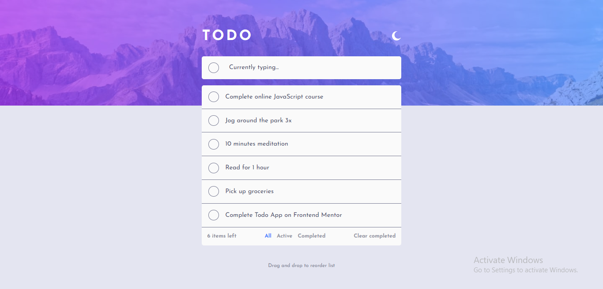

# Frontend Mentor - Todo app solution

This is a solution to the [Todo app challenge on Frontend Mentor](https://www.frontendmentor.io/challenges/todo-app-Su1_KokOW). Frontend Mentor challenges help you improve your coding skills by building realistic projects.

## Table of contents

- [Overview](#overview)
  - [The challenge](#the-challenge)
  - [Screenshot](#screenshot)
  - [Links](#links)
- [My process](#my-process)
  - [Built with](#built-with)
  - [What I learned](#what-i-learned)
- [Author](#author)
- [Acknowledgments](#acknowledgments)

## Overview

### The challenge

Users should be able to:

- View the optimal layout for the app depending on the device's screen size
- See hover states for all interactive elements on the page
- Add new todos to the list
- Mark todos as complete
- Delete todos from the list
- Filter by all/active/complete todos
- Clear all completed todos
- Toggle light and dark mode
- **Bonus**: Drag and drop to reorder items on the list
- **Bonus**: - Update active todos

### Screenshot



### Links

- Solution URL: [Add solution URL here](https://your-solution-url.com)
- Live Site URL: https://todo-vortex.netlify.app/

## My process

### Built with

- Semantic HTML5 Markup
- CSS Custom Properties
- Flexbox
- CSS Grid
- Mobile-First Workflow
- Vite
- Sass - CSS Preprocessor
- [React](https://react.dev/) - JS Library
- React Context API
- HTML5 Drag and Drop API Library (react-beautiful-dnd)
- TypeScript

### What I learned

#### React Beautiful DND Library

```js
<Droppable>{...}</Droppable>
<Draggable>{...}</Draggable>
```

#### Using TypeScript in a React Application and learning about various element types

```js
const inputRef = useRef<HTMLInputElement>(null);
```

## Author

- Frontend Mentor - [@peterxavier01](https://www.frontendmentor.io/profile/peterxavier01)
- Twitter - [@peter_uadiale](https://www.twitter.com/yourusername)

## Acknowledgments

I would like to appreciate the ideas, pointers, and help in general, gotten from Stackoverflow, ChatGPT, and the Bobby Hadz blog.
